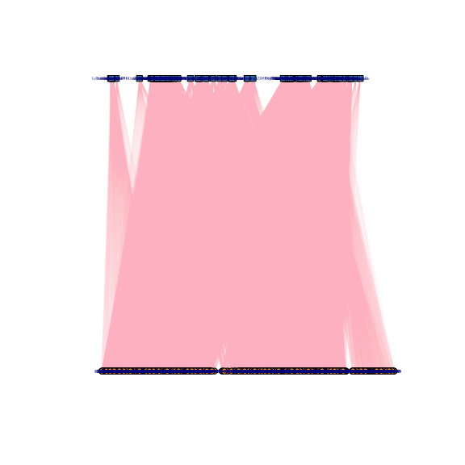
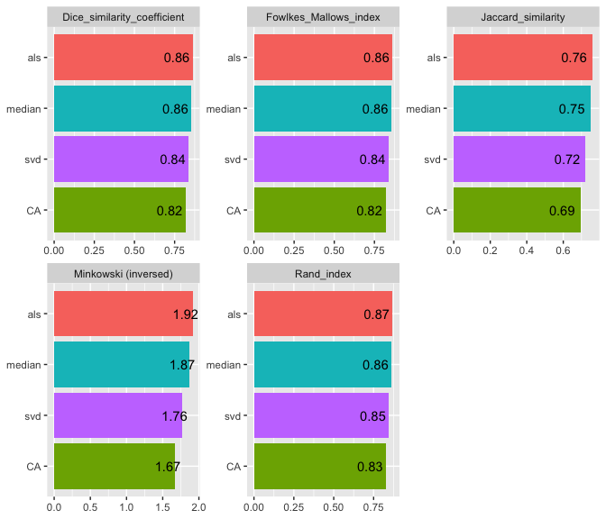

<!-- README.md is generated from README.Rmd. Please edit that file -->

# NIMAA <a href='https://github.com/jafarilab/NIMAA'></a>

<!-- badges: start -->

[](https://cran.r-project.org/package=NIMAA)
[](https://github.com/jafarilab/NIMAA/releases)
[](https://github.com/jafarilab/NIMAA)

<!-- badges: end -->

The NIMAA package \[@nimaa\] provides a comprehensive set of methods for
performing nominal data mining.

It employs bipartite networks to demonstrate how two nominal variables
are linked, and then places them in the incidence matrix to proceed with
network analysis. NIMAA aids in characterizing the pattern of missing
values in a dataset, locating large submatrices with non-missing values,
and predicting edges within nominal variable labels. Then, given a
submatrix, two unipartite networks are constructed using various network
projection methods. NIMAA provides a variety of choices for clustering
projected networks and selecting the best one. The best clustering
results can also be used as a benchmark for imputation analysis in
weighted bipartite networks.

## Installation

You can install the released version of NIMAA from
[CRAN](https://CRAN.R-project.org) with:

``` r
install.packages("NIMAA")
```

And the development version from [GitHub](https://github.com/) with:

``` r
# install.packages("devtools")
devtools::install_github("jafarilab/NIMAA")
```

## Example

### Plotting the original data

``` r
library(NIMAA)
## load the beatAML data
beatAML_data <- NIMAA::beatAML

# plot the original data
beatAML_incidence_matrix <- plotIncMatrix(
  x = beatAML_data, # original data with 3 columns
  index_nominal = c(2,1), # the first two columns are nominal data
  index_numeric = 3,  # the third column is numeric data
  print_skim = FALSE, # if you want to check the skim output, set this as TRUE
  plot_weight = TRUE, # when plotting the weighted incidence matrix
  verbose = FALSE # NOT save the figures to local folder
  )
#> 
#> Na/missing values Proportion:     0.2603
```


### Plotting the bipartite network of the original data

``` r
plotBipartite(inc_mat = beatAML_incidence_matrix, vertex.label.display = T)
```



    #> IGRAPH 7cf38ef UNWB 650 47636 -- 
    #> + attr: name (v/c), type (v/l), shape (v/c), color (v/c), weight (e/n)
    #> + edges from 7cf38ef (vertex names):
    #>  [1] Alisertib (MLN8237)      --11-00261 Barasertib (AZD1152-HQPA)--11-00261
    #>  [3] Bortezomib (Velcade)     --11-00261 Canertinib (CI-1033)     --11-00261
    #>  [5] Crenolanib               --11-00261 CYT387                   --11-00261
    #>  [7] Dasatinib                --11-00261 Doramapimod (BIRB 796)   --11-00261
    #>  [9] Dovitinib (CHIR-258)     --11-00261 Erlotinib                --11-00261
    #> [11] Flavopiridol             --11-00261 GDC-0941                 --11-00261
    #> [13] Gefitinib                --11-00261 Go6976                   --11-00261
    #> [15] GW-2580                  --11-00261 Idelalisib               --11-00261
    #> + ... omitted several edges

### Extracting large submatrices without missing values

The `extractSubMatrix()` function extracts the submatrices that have
non-missing values or have a certain percentage of missing values inside
(not for elements-max matrix), depending on the argument’s input. The
package vignette and help manual contain more details.

``` r
sub_matrices <- extractSubMatrix(
  x = beatAML_incidence_matrix,
  shape = c("Square", "Rectangular_element_max"), # the selected shapes of submatrices
  row.vars = "patient_id",
  col.vars = "inhibitor",
  plot_weight = TRUE,
  print_skim = FALSE
  )
#> binmatnest2.temperature 
#>                20.12539 
#> Size of Square:   96 rows x  96 columns 
#> Size of Rectangular_element_max:      87 rows x  140 columns
```


### Cluster finding analysis of projected unipartite networks

The `findCluster()` function implements seven widely used network
clustering algorithms, with the option of preprocessing the input
incidence matrix following the projecting of the bipartite network into
unipartite networks. Also, internal and external measurements can be
used to compare clustering algorithms. Details can be found in the
package vignette and help manual.

``` r
cls <- findCluster(
  sub_matrices$Rectangular_element_max,
  part = 1,
  method = "all", # all available clustering methods
  normalization = TRUE, # normalize the input matrix
  rm_weak_edges = TRUE, # remove the weak edges in the network
  rm_method = 'delete', # delete the weak edges instead of lowering their weights to 0.
  threshold = 'median', # Use median of edges' weights as threshold
  set_remaining_to_1 = TRUE, # set the weights of remaining edges to 1
  )
#> Warning in findCluster(sub_matrices$Rectangular_element_max, part = 1, method =
#> "all", : cluster_spinglass cannot work with unconnected graph
#> 
#> 
#> |             |  walktrap|   louvain|   infomap| label_prop| leading_eigen| fast_greedy|
#> |:------------|---------:|---------:|---------:|----------:|-------------:|-----------:|
#> |modularity   | 0.0125994| 0.0825865| 0.0000000|  0.0000000|     0.0806766|   0.0825865|
#> |avg.silwidth | 0.2109092| 0.1134990| 0.9785714|  0.9785714|     0.1001961|   0.1134990|
#> |coverage     | 0.9200411| 0.5866393| 1.0000000|  1.0000000|     0.5806783|   0.5866393|
```


### Edge predicting in weighted bipartite networks

The `predictEdge()` function predicts new edges between nominal
variables’ labels or imputes missing values in the input data matrix
using several imputation methods. We can compare the imputation results
using the `validateEdgePrediction()` function to choose the best method
based on a predefined benchmark. The package vignette and help manual
contain more details.

``` r
imputations <- predictEdge(
  inc_mat = beatAML_incidence_matrix,
  method = c('svd','median','als','CA')
  )
```

``` r
validateEdgePrediction(imputation = imputations,
                   refer_community = cls$fast_greedy,
                   clustering_args = cls$clustering_args)
#> 
#> 
#> |       | Jaccard_similarity| Dice_similarity_coefficient| Rand_index| Minkowski (inversed)| Fowlkes_Mallows_index|
#> |:------|------------------:|---------------------------:|----------:|--------------------:|---------------------:|
#> |median |          0.7476353|                   0.8555964|  0.8628983|             1.870228|             0.8556407|
#> |svd    |          0.7224792|                   0.8388829|  0.8458376|             1.763708|             0.8388853|
#> |als    |          0.7599244|                   0.8635875|  0.8694758|             1.916772|             0.8635900|
#> |CA     |          0.6935897|                   0.8190765|  0.8280576|             1.670030|             0.8191111|
```



    #>   imputation_method Jaccard_similarity Dice_similarity_coefficient Rand_index
    #> 1            median          0.7476353                   0.8555964  0.8628983
    #> 2               svd          0.7224792                   0.8388829  0.8458376
    #> 3               als          0.7599244                   0.8635875  0.8694758
    #> 4                CA          0.6935897                   0.8190765  0.8280576
    #>   Minkowski (inversed) Fowlkes_Mallows_index
    #> 1             1.870228             0.8556407
    #> 2             1.763708             0.8388853
    #> 3             1.916772             0.8635900
    #> 4             1.670030             0.8191111

## License

[](https://opensource.org/licenses/)
