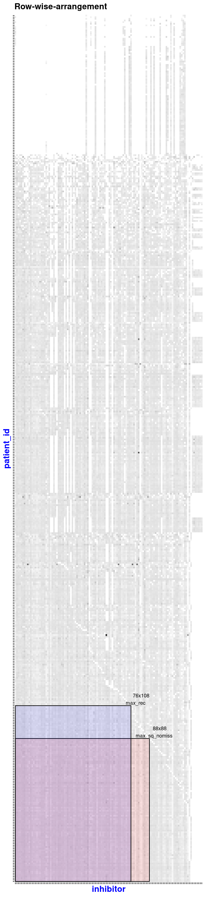
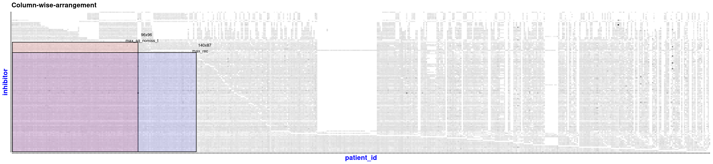

```{r, include = FALSE}
knitr::opts_chunk$set(
  collapse = TRUE,
  comment = "#>"
)
```
## Introduction
Many numerical analyses are invalid when working with nominal data because the mode is the only way to measure central tendency for nominal data, and frequency testing, like Chi-square tests, is the most common statistical analysis that makes sense.
`NIMAA` package [@nimaa] proposes a comprehensive set of pipeline to perform nominal data mining, which can effectively find label relationships of each nominal variable according to pairwise association with other nominal data. You can also check for updates, here [NIMAA](https://github.com/jafarilab/NIMAA).

It uses bipartite graphs to show how two different types of data are linked together, and it puts them in the incidence matrix to continue with network analysis. Finding large submatrices with non-missing values and edge prediction are other applications of NIMAA to explore local and global similarities within the labels of nominal variables.

Then, using a variety of different network projection methods, two unipartite graphs are constructed on the given submatrix. NIMAA provides several options for clustering projected networks and selecting the best one based on internal measures and external prior knowledge (ground truth). When weighted bipartite networks are considered, the best clustering results are used as the benchmark for edge prediction analysis. This benchmark is used to figure out which imputation method is the best one to predict weight of edges in bipartite network. It looks at how similar the clustering results are before and after the imputations. By using edge prediction analysis, we tried to get more information from the whole dataset even though there were some missing values.
```{r setup}
library(NIMAA)
```
## 1 Exploring the data
In this section, we demonstrate how to do a NIMAA analysis on a weighted bipartite network using the `beatAML` dataset. `beatAML` is one of four datasets that can be found in the `NIMAA` package [@nimaa]. This dataset has three columns: the first two contain nominal variables, while the third contains numerical variables.

```{r show data,echo=FALSE, results='asis'}
knitr::kable(NIMAA::beatAML[1:10,], caption='The first ten rows of beatAML dataset')
```
Read the data from the package:
```{r read the data}
# read the data
beatAML_data <- NIMAA::beatAML
```

### 1.1 Plotting the original data
The `plotIncMatrix()` function prints some information about the incidence matrix derived from input data, such as its dimensions and the proportion of missing values, as well as the image of the matrix. It also returns the incidence matrix object.

NB: To keep the size of vignette small enough for CRAN rules, we won't output the interactive figure here.
```{r plotIncMatrix function, results='asis'}
beatAML_incidence_matrix <- plotIncMatrix(
  x = beatAML_data, # original data with 3 columns
  index_nominal = c(2,1), # the first two columns are nominal data
  index_numeric = 3,  # the third column is numeric data
  print_skim = FALSE, # if you want to check the skim output, set this as TRUE
  plot_weight = TRUE, # when plotting the weighted incidence matrix
  verbose = FALSE # NOT save the figures to local folder
  )
```

```{r, echo=FALSE, out.width="100%", fig.cap="The beatAML dataset as an incidence matrix"}
knitr::include_graphics("patient_id-inhibitor.png")
```

### 1.2 Plotting the bipartite network of the original data
Given that we have the incidence matrix, we can easily reconstruct the corresponding bipartite network. In the `NIMAA` package, we have two options for visualizing the bipartite network: static or interactive plots.

#### 1.2.1 Static plot
The `plotBipartite()` function customizes the corresponding bipartite network visualization based on the `igraph` package [@igraph] and returns the igraph object.

```{r plotBipartite, fig.height = 7, fig.width = 7, fig.align = "center"}
bipartGraph <- plotBipartite(inc_mat = beatAML_incidence_matrix, vertex.label.display = T)

# show the igraph object
bipartGraph
```

#### 1.2.2 Interactive plot
The `plotBipartiteInteractive()` function generates a customized interactive bipartite network visualization based on the `visNetwork` package [@vis].

NB: To keep the size of vignette small enough, we do not output
the interactive figure here. Instead, we show a screenshot of part of the `beatAML` dataset.

```{r plotBipartiteInteractive, results='hide'}
plotBipartiteInteractive(inc_mat = beatAML_incidence_matrix)
```

```{r, echo=FALSE, out.width="100%", fig.cap="beatAML dataset as incidence matrix"}

```
### 1.3 Analysis of network properties
`NIMAA` package contains a function called `analyseNetwork` to provide more details about the network topology and common centrality measures for vertices and edges.

```{r}
analysis_reuslt <- analyseNetwork(bipartGraph)

# showing the general measures for network topology
analysis_reuslt$general_stats
```

## 2 Extracting large submatrices without missing values
In the case of a weighted bipartite network, the dataset with the fewest missing values should be used for the next steps. This is to avoid the sensitivity problems of clustering-based methods. The `extractSubMatrix()` function extracts the submatrices that have non-missing values or have a certain percentage of missing values inside (not for elements-max matrix), depending on the argument's input. The result will also be shown as a `plotly` plot [@plotly], so you can see the screenshots of `beatAML` dataset below.

The extraction process is performed and visualized in two ways, which can be chosen depending on the user's preference: using the original input matrix (row-wise) and using the transposed matrix (column-wise). `NIMAA` extracts the largest submatrices with non-missing values or with a specified proportion of missing values (using the `bar` argument) in four ways predefined in the `shape` argument:

- **Square**, to extract square matrix with the equal number of rows and columns,
- **Rectangular_row**, to extract matrix with the maximum number of rows, 
- **Rectangular_col**, to extract matrix with the maximum number of columns,  
- **Rectangular_element_max**, to extract matrix with the maximum number of elements.

Here we extract two shapes of submatrix from the `beatAML_incidence_matrix` including square and rectangular, with the maximum number of elements:

```{r extractSubMatrix,eval=TRUE, echo=TRUE}
sub_matrices <- extractSubMatrix(
  x = beatAML_incidence_matrix,
  shape = c("Square", "Rectangular_element_max"), # the selected shapes of submatrices
  row.vars = "patient_id",
  col.vars = "inhibitor",
  plot_weight = TRUE,
  print_skim = FALSE
  )
```

NB: To keep the size of vignette small enough, we show a screenshot.
```{r, echo=FALSE, out.width="30%", fig.cap="Row-wise arrangement"}

```
```{r, echo=FALSE, out.width="100%", fig.cap="Column-wise arrangement"}

```

A value called **binmatnest2.temperature** is also printed by this function that indicates the nestedness measure of the input matrix. If the input matrix is highly nested (`binmatnest2.temperature >= 1`), then splitting the input matrix into parts is recommended to follow the analysis in each part independently.

## 3 Cluster finding analysis of projected unipartite networks
The `findCluster()` function performs seven commonly used network clustering algorithms, with the option of preprocessing the input incidence matrix following the projecting of the bipartite network into unipartite networks. Preprocessing options such as using normalization and defining a threshold help us remove edges that have low weights or are weak edges. Also, it is possible to continue using binarized or original edge weights before performing community detection or clustering. Finally, all of the clustering methods that were used can be compared and the best one chosen based on internal or external cluster validity measures such as average of silhouette width and Jaccard similarity index. Additionally to displaying in consul, the findings are provided as bar plots.

To begin, let us examine how to utilize `findCluster` to find clusters of `patient_id`s based on the `Rectangular_element_max` submatrix of the `beatAML` bipartite network projection to a patient's unipartite similarity network.

```{r, eval=TRUE, echo= TRUE, results='hide',error=FALSE, warning=FALSE, message=FALSE, fig.height = 3, fig.width = 7, fig.align = "center"}
cls1 <- findCluster(
  sub_matrices$Rectangular_element_max,
  part = 1,
  method = "all", # all available clustering methods
  normalization = TRUE, # normalize the input matrix
  rm_weak_edges = TRUE, # remove the weak edges in graph
  rm_method = 'delete', # delete the weak edges instead of lowering their weights to 0.
  threshold = 'median', # Use median of edges' weights as threshold
  set_remaining_to_1 = TRUE, # set the weights of remaining edges to 1
  )
```

Additionally, if external features (prior knowledge) are provided, the function compares the clustering results obtained with the external features in terms of similarity by setting `extra_feature` argument.

For instance, let's generate some random features for the patients in the `beatAML` dataset. The following is an example:

```{r generate extra features, eval=TRUE, echo=TRUE, results='asis'}
external_feature <- data.frame(row.names = cls1$walktrap$names)
external_feature[,'membership'] <- paste('group',
                                         findCluster(sub_matrices$Rectangular_element_max,
                                                     method = c('walktrap'),
                                                     rm_weak_edges = T,
                                                     set_remaining_to_1 = F,
                                                     threshold = 'median',
                                                     comparison = F)$walktrap$membership)
dset1 <- utils::head(external_feature)
knitr::kable(dset1, format = "html")

```

Clustering is done on the patient similarity network again, but this time by setting the `extra_feature` argument to provide external validation for the cluster finding analysis.

```{r findcluster 1, eval=TRUE, fig.height = 6, fig.width = 7, fig.align = "center"}
cls <- findCluster(
  sub_matrices$Rectangular_element_max,
  part = 1,
  method = "all", 
  normalization = TRUE, 
  rm_weak_edges = TRUE, 
  rm_method = 'delete', 
  threshold = 'median', 
  set_remaining_to_1 = TRUE, 
  extra_feature = external_feature # add an extra feature reference here
  )
```

As you can see, two new indices are included (`jaccard_similarity` and `corrected_rand`) as external cluster validity measures which represent the similarity between clustering and the prior knowledge used as ground truth.

The following sections show how to perform clustering analysis on the other part of the `beatAML` bipartite network, namely, `inhibitor`. In this case, we simply need to modify the `part` to 2.

```{r,eval=TRUE,fig.height = 3, fig.width = 7, fig.align = "center"}
cls2 <- findCluster(
  sub_matrices$Rectangular_element_max, # the same submatrix
  part = 2 # set to 2 to use the other part of bipartite network
  )
```

## 4 Exploring the clusters
In this section, we look at the clustering results, with a particular emphasis on cluster visualization and scoring measures.

### 4.1 Displaying Clusters inside the unipartite network
The `plotCluster()` function makes an interactive network figure that shows nodes that belong to the same cluster in the same color and nodes that belong to different clusters in separate colors.

```{r plotcluster,eval = FALSE}
plotCluster(graph=cls2$graph,cluster = cls2$louvain)
```

NB: To keep the size of vignette small enough, we do not output
the interactive figure here. Instead, we show a screenshot.
```{r, echo=FALSE, out.width="100%", fig.cap="Interactive plot for function plotCluster()"}
knitr::include_graphics("plotCluster.png")
```

### 4.2 Displaying Clusters' relationship inside the bipartite network
The Sankey diagram is used to depict the connections between clusters within each part of the bipartite network. The display is also interactive, and by grouping nodes within each cluster as "summary" nodes, the `visualClusterInBipartite` function emphasizes how clusters of each part are connected together. 

```{r visualClusterInBipartite, eval = FALSE}
visualClusterInBipartite(
  data = beatAML_data,
  community_left = cls1$leading_eigen,
  community_right = cls2$fast_greedy,
  name_left = 'patient_id',
  name_right = 'inhibitor')
```

NB: To keep the size of vignette small enough, we do not output
the interactive figure here. Instead, we show a screenshot.
```{r, echo=FALSE, out.width="100%", fig.cap="Interactive plot for function visualClusterInBipartite()"}
knitr::include_graphics("visualClusterInBipartite.png")
```

### 4.3 Scoring clusters
Based on the `fpc` package [@fpc], and @DBLP, the `scoreCluster` function provides additional internal cluster validity measures such as entropy and coverage. The concept of scoring is according to the weight fraction of all intra-cluster edges relative to the total weight of all edges in the network.

```{r,eval=FALSE, echo=TRUE}
scoreCluster(community = cls2$infomap,
             graph = cls2$graph,
             dist_mat = cls2$distance_matrix)
```

### 4.4 Validating clusters based on prior knowledge
The `validateCluster()` function calculates the similarity of a given clustering method to the provided ground truth. This function provides external cluster validity measures including `corrected.rand` and `jaccard similarity`.

```{r,eval=TRUE}
validateCluster(community = cls$leading_eigen,
                extra_feature = external_feature,
                dist_mat = cls$distance_matrix)
```

## 5 Edge prediction
### 5.1 Predicting of edge in bipartite network
The `predictEdge()` function utilizes the given imputation methods to impute missing values in the input data matrix. The output is a list with each element representing an updated version of input data matrix with no missing values using a separate imputation method. The following is a detailed list of imputation techniques:

- **median** will replace the missing values with the median of each rows (observations),

- **knn** is the method in `bnstruct` package [@bnstruct],

- **als** and **svd** are methods from `softImpute` package[@softImpute],

- **CA**, **PCA** and **FAMD** are from `missMDA` package [@missMDA],

- others are from the famous `mice` package [@mice].

```{r}
imputations <- predictEdge(inc_mat = beatAML_incidence_matrix,
                                  method = c('svd','median','als','CA'))
# show the result format
summary(imputations)
```

### 5.2 Validating edge prediction
The `validateEdgePrediction()` function compares the results of clustering after imputation with a predefined benchmark to see how similar they are. After validating clustering on submatrices with non-missing values, the benchmark had already been set up in the previous step. This function does the analysis for a number of user-specified imputation methods. It's also possible to see how each method is ranked by looking at a ranking plot. The following measures are used to compare the methods:

- Jaccard similarity index

- Dice similarity coefficient

- Rand index

- Minkowski measure (inverted)

- Fowlkes–Mallows index

```{r, eval=TRUE, fig.height = 6, fig.width = 7, fig.align = "center"}
validateEdgePrediction(imputation = imputations,
                   refer_community = cls1$fast_greedy,
                   clustering_args = cls1$clustering_args)
```

Finally, the best imputation method can be chosen, allowing for a re-examination of the label relationships or a re-run of the nominal data mining. In other words, users can use this imputed matrix as an input matrix to redo the previous steps of mining the hidden relationships in the original dataset. Note that this matrix has no missing values, hence no submatrix extraction is required.

## References
